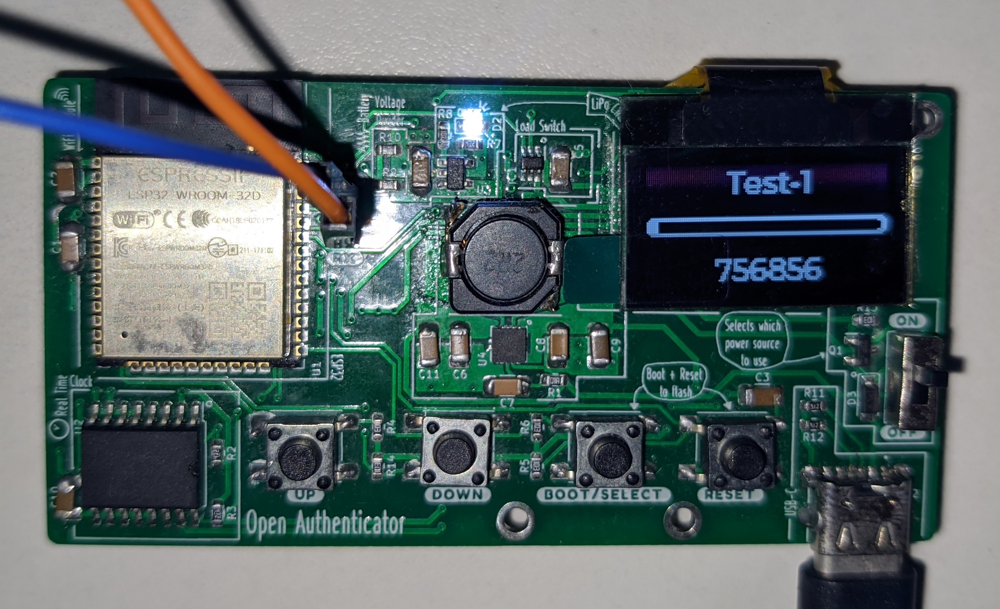

# Software Upload

## Requirements

* *ESP-IDF* **v4.2** (*release/v4.2*)
* Open-Authenticator board
* USB-UART convertor board (to flash firmware)

Install instructions are available
[here](https://docs.espressif.com/projects/esp-idf/en/latest/esp32/get-started/).
Make sure to install `v4.2` (step 2 in the given link).

## Compile firmware

```bash
git clone --recurse-submodules https://github.com/Open-Authenticator/open-authenticator-app.git
cd open-authenticator-app
# activate esp-idf environment (get_idf)
get_idf
# build firmare
idf.py build
```

## Flash firmware

### 1) Connect USB-UART to open-authenticator UART port
```
connect as follows

USB-UART----|== RX ==> --- <== TX ==|----Open Authenticator UART port
            |                       |  
            |== TX ==> --- <== RX ==|
``` 


**It should look like this after being connected**


### 2) Connect USB Type-C to power the board

* It is necessary to power the board using usb while flashing firmware. Both the
usb to uart convertor and open authenticator board must be powered by same power
source, as we haven't connected ground of the convertor to that of board. 
* If one wants to flash without powering it up with usb, connect ground of usb-uart
convertor to the shield of the usb-c port.

### 3) Put board in download mode

* While board is powered on, press `BOOT/SELECT` button, and
  simultaneously press `RESET` button. Leave the `BOOT/SELECT` button after a
  few seconds.

### 4) Flash firmware

```bash
idf.py flash
```

After it successfully flashes, press `RESET` and see it come to power, use the
buttons to navigate and use it.


